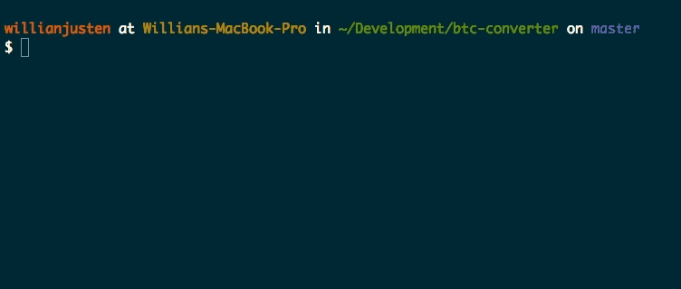

# Bitcoin Converter CLI

> A CLI to convert Bitcoin to any currency provided.



Want to learn how to create your own CLI? [Check this course about JS with TDD](https://www.udemy.com/js-com-tdd-na-pratica/?couponCode=GITHUB_LINK)

### Installing

```
$ npm install -g btc-converter
```

### How to use

```sh
btc-converter --help

  Usage: btc-converter [options]

  Convert Bitcoin to any currency defined

  Options:

    -h, --help                 output usage information
    -V, --version              output the version number
    -C, --currency <currency>  Currency to be converted. (Default: USD)
    -A, --amount <amount>      Value in Bitcoin to convert. (Default: 1)
```

## Contributing

Please read [CONTRIBUTING.md](CONTRIBUTING.md) for details on our code of conduct, and the process for submitting pull requests to us.

## License

This project is licensed under the MIT License - see the [LICENSE.md](LICENSE.md) file for details
